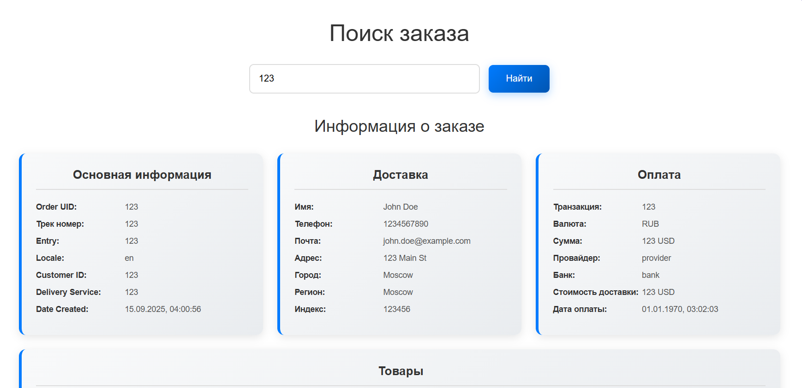

# WBTechTestTask

## О проекте

Мой проект - демонстрационный сервис на Go с использованием базы данных и очереди сообщений. Сервис получает данные заказов из очереди (Kafka), сохраняет их в базу данных (PostgreSQL) и кэширует в памяти для быстрого доступа.

### 🌐 Доступные API эндпоинты

| Метод | Путь                        | Описание                                                     |
| :--- |:----------------------------|:-------------------------------------------------------------|
| POST | /api/v1/create              | Создание заказа                                              |
| GET | /api/v1/order/:orderId      | Получение заказа по Id                                       |
| GET | /api/v1/stresstest/:orderId | Тестовый эндпоинт для сравнения скорости доступа к кэшу и бд |

## ⚡ Взаимодействие с Kafka

Сервис реализует **консюмер Kafka**, который работает в режиме постоянного чтения очереди.

### 🔄 Процесс обработки сообщения
1. Получение заказа из Kafka.
2. Валидация структуры сообщения (JSON → модель Go).
3. Проверка бизнес-правил (например, уникальность `order_uid`).
4. Сохранение заказа в PostgreSQL.
5. Подтверждение обработки (commit offset).

### 🛠️ Дополнительные особенности
- **Формат сообщений**: JSON (структура строго соответствует модели `Order`).
- **Масштабируемость**: консюмер может быть запущен в нескольких экземплярах, распределение сообщений происходит через **consumer group**.
- **Обработка ошибок**:
    - при ошибке валидации сообщение пропускается;
    - при ошибке записи в БД — логирование;
- **Гарантия доставки**: как минимум один раз (*at-least-once*).

### 📊 Пример сообщения в Kafka
```json
{
  "order_uid": "user12345",
  "track_number": "WBILMTESTTRACK",
  "entry": "WBIL",
  "delivery": {
    "name": "Test Testov",
    "phone": "+9720000000",
    "zip": "2639809",
    "city": "Kiryat Mozkin",
    "address": "Ploshad Mira 15",
    "region": "Kraiot",
    "email": "test@gmail.com"
  },
  "payment": {
    "transaction": "b563feb7b2b84b6test",
    "request_id": "",
    "currency": "USD",
    "provider": "wbpay",
    "amount": 1817,
    "payment_dt": 1637907727,
    "bank": "alpha",
    "delivery_cost": 1500,
    "goods_total": 317,
    "custom_fee": 0
  },
  "items": [
    {
      "chrt_id": 9934930,
      "track_number": "WBILMTESTTRACK",
      "price": 453,
      "rid": "ab4219087a764ae0btest",
      "name": "Mascaras",
      "sale": 30,
      "size": "0",
      "total_price": 317,
      "nm_id": 2389212,
      "brand": "Vivienne Sabo",
      "status": 202
    }
  ],
  "locale": "en",
  "internal_signature": "",
  "customer_id": "test",
  "delivery_service": "meest",
  "shardkey": "9",
  "sm_id": 99,
  "date_created": "2021-11-26T06:22:19Z",
  "oof_shard": "1"
}
```

## 🗃️ Кэширование данных

При запуске сервиса данные из **PostgreSQL** предварительно подгружаются в кэш.

### 🔄 Механизм работы кэша
- При добавлении **нового заказа** данные в кэше не обновляются сразу.
- Кэш обновляется только при **вторичном запросе** к одному и тому же заказу.
- Инвалидация выполняется с помощью **TTL**:
    - каждые **30 секунд** запускается фоновая функция;
    - проверяется, сколько заказов находится в кэше;
    - устаревшие записи удаляются.

### ⚡ Тест производительности
Были проведены замеры скорости доступа к данным:

| Метрика | Значение |
|---------|----------|
| Количество запросов к кэшу | **100 000** |
| Среднее время доступа к кэшу | **16ns** |
| Полное время всех обращений к кэшу | **1.6425ms** |
| Время одного запроса к БД | **3.7308ms** |

📊 **Вывод:** доступ к данным через кэш работает **намного быстрее**, чем прямые обращения к базе данных.

## 🗄️ База данных

В качестве базы данных используется **PostgreSQL**.

### 🛠️ Миграции

Для создания и управления схемой базы данных применяются миграции, которые находятся в папке [`migrations/`](./migrations).

### 🗃️ Структура базы данных

В базе данных предусмотрена одна таблица `orders`:

| Поле                | Тип         | Описание                                      |
| :------------------ | :---------- | :-------------------------------------------- |
| order\_uid          | VARCHAR(50) | Уникальный идентификатор заказа (PRIMARY KEY) |
| track\_number       | VARCHAR(50) | Трек-номер посылки                            |
| entry               | VARCHAR(10) | Канал/точка входа заказа                      |
| locale              | VARCHAR(10) | Локаль заказа (язык, страна)                  |
| internal\_signature | VARCHAR(50) | Внутренняя подпись/токен                      |
| customer\_id        | VARCHAR(50) | Идентификатор покупателя                      |
| delivery\_service   | VARCHAR(50) | Служба доставки                               |
| shardkey            | VARCHAR(10) | Шард-ключ для распределения данных            |
| sm\_id              | INTEGER     | Внутренний идентификатор SM                   |
| date\_created       | VARCHAR(50) | Дата создания заказа                          |
| oof\_shard          | VARCHAR(10) | Шард OOF                                      |
| delivery            | JSONB       | Информация о доставке (имя, адрес, контакты)  |
| payment             | JSONB       | Информация об оплате                          |
| items               | JSONB       | Список товаров заказа                         |

## Технологии и библиотеки
Проект написан на языке **Go** и использует следующие библиотеки и инструменты:


#### Язык программирования:
- **Go** (версия 1.24.0)

## 📚 Используемые библиотеки
В проекте используются следующие ключевые Go-библиотеки:

### 🔑 Основные утилиты
| Библиотека                           | Назначение                                                                       | Документация                                         |
| ------------------------------------ | -------------------------------------------------------------------------------- | ---------------------------------------------------- |
| `github.com/ilyakaznacheev/cleanenv` | Чтение и валидация конфигурации из окружения и файлов (`.env`, `.yaml`, `.json`) | [ссылка](https://github.com/ilyakaznacheev/cleanenv) |
| `github.com/joho/godotenv`           | Загрузка переменных окружения из `.env` файлов                                   | [ссылка](https://github.com/joho/godotenv)           |
| `github.com/google/uuid`             | Генерация и парсинг UUID (уникальных идентификаторов)                            | [ссылка](https://github.com/google/uuid)             |

### 🕸️ Веб и API
| Библиотека                    | Назначение                                                  | Документация                                  |
| ----------------------------- | ----------------------------------------------------------- | --------------------------------------------- |
| `github.com/gin-gonic/gin`    | Высокопроизводительный HTTP-фреймворк для создания REST API | [ссылка](https://github.com/gin-gonic/gin)    |
| `github.com/gin-contrib/cors` | Middleware для обработки CORS-запросов в Gin                | [ссылка](https://github.com/gin-contrib/cors) |

### 🗃️ Работа с данными

| Библиотека                        | Назначение                                                                             | Документация                                      |
| --------------------------------- | -------------------------------------------------------------------------------------- | ------------------------------------------------- |
| `github.com/jackc/pgx/v5`         | Высокопроизводительный драйвер PostgreSQL (работа с транзакциями, пулами, COPY и т.д.) | [ссылка](https://github.com/jackc/pgx)            |
| `github.com/Masterminds/squirrel` | SQL query builder для удобной генерации SQL-запросов                                   | [ссылка](https://github.com/Masterminds/squirrel) |
| `github.com/segmentio/kafka-go`   | Клиент Kafka для продюсеров и консумеров на Go                                         | [ссылка](https://github.com/segmentio/kafka-go)   |

### 📝 Логирование

| Библиотека        | Назначение                                                    | Документация                      |
| ----------------- | ------------------------------------------------------------- | --------------------------------- |
| `go.uber.org/zap` | Быстрое структурированное логирование с минимальным оверхедом | [ссылка](https://go.uber.org/zap) |

## 📚 Структура проекта

```bash
├── cmd/ #Основной исполняемый файл проекта
├── config/ #Конфигурационные файлы
├── docs/ # Swagger документация
├── demonstration/ # Видео для демонстрации
├── frontend/ # Фронтенд сервиса
├── internal/ # Внутренняя бизнес-логика (не предназначена для внешнего использования)
│   ├── app/ # Инициализация приложения 
│   ├── config/ # Конфигурация приложения
│   ├── kafka/ # Взаимодействие с kafka
│   ├── models/ # Модели данных
│   ├── repository/ # Слой взаимодействия с базой данных
│   ├── service/ # Слой бизнес-логики
│   ├── transport/ # Слой взаимодействия с пользователем
├── migrations/ # Скрипты миграций базы данных
├── pkg/ # Публичные пакеты, доступные извне (reusable)
│   ├── logger/ # Пакет логирования
│   ├── postgres/ # Пакет работы с базой данных PostgreSQL
```

## 📚 Запуск проекта

Для запуска проекта необходимо выполнить следующие шаги:

```
git clone https://github.com/VladimirGladky/WBTechTestTask.git
```

```
cd WBTechTestTask
```

Теперь вы можете запустить проект , но для этогт нужно чтобы был установлен Go версии 1.24.0
Ссылка для скачивания: [Go Download](https://go.dev/doc/install)

Перед запуском сервиса , воспользуйтесь командой

```bash
go mod download
```

### Запуск сервера

```bash
docker compose up
```

Вы запустите базу данных , и утилиты для взаимодействия с kafka

Для остановки в будущем используйте:
```bash
docker compose down
```

Потом выполните вот это:


```bash
go run ./cmd/main.go
```

Запустится сервер и потом запустите веб-интерфейс:

Перейдите в папку frontend:
```bash
cd frontend
```

Для запуска вам потребуется npx , вы можете установить его по ссылке https://nodejs.org/en: 

```bash
npx serve
```

Веб-интерфейс будет открыт по ссылке http://localhost:3000, там вы можете ввести id заказа и получить данные о нём

Это будет выглядеть примерно вот так:


